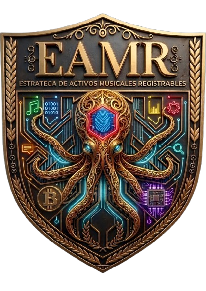

  <!-- This outer div establishes the global center and full width -->
  

    <!-- This inner div creates the continuous dark panel with appropriate spacing -->

    

      

    <!-- Original typing banner remains unchanged -->
    

      

    <!-- Adjusted button layout to ensure good positioning on the new panel -->
    

      
      
      
    

    <!-- This div ends the internal dark panel -->
  

<!-- This div ends the general centering -->

---

### 🎙️ Sobre EAMR

**EAMR (Estratega de Activos Musicales Registrables)** es un catálogo de composiciones originales
generadas con IA, listas para licenciamiento comercial. Cada tema incluye ficha técnica,
clasificación de género/subgénero y descriptores emocionales.

 

<b>🎧 Explorar el catálogo</b> — haz clic para desplegar

 

| Sección | Descripción |
|---|---|
| 🎼 Catálogo completo | +20 canciones con página individual y reproductor |
| 💰 Tarifario | Tarjetas de precios por tipo de licencia |
| 📄 Documentos legales | Contratos de cesión de derechos y tarifarios en PDF |
| 🧮 Simulador de licencias | Cuestionario interactivo de 3 pasos para elegir la licencia correcta |

➡️ **[Ir al catálogo en vivo](https://edheller33.github.io/Music_dem/)**

<b>⚖️ Licenciamiento</b> — condiciones comerciales

 

- Composiciones originales, generadas con asistencia de IA, con derechos claros para transferencia.
- Tarifario por niveles disponible en el sitio (uso personal, comercial, exclusivo).
- Contrato de cesión de derechos disponible en PDF descargable.

<b>🛠️ Stack técnico</b>

 

- Sitio estático servido con **GitHub Pages**
- Identidad visual oro/negro/verde — tipografías `Orbitron`, `Cinzel Decorative`, `Crimson Pro`, `Rajdhani`
- Reproductor de audio embebido por tema
- PDFs comerciales generados con `ReportLab`

 

Emblema y catálogo © Edgardo Romero — EAMR

